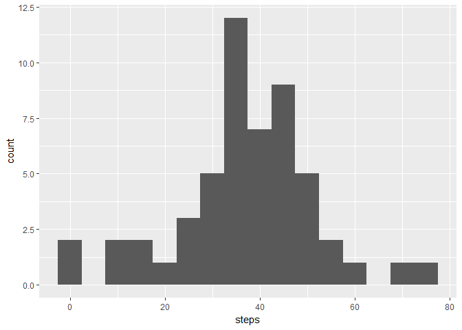
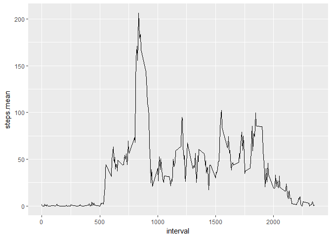
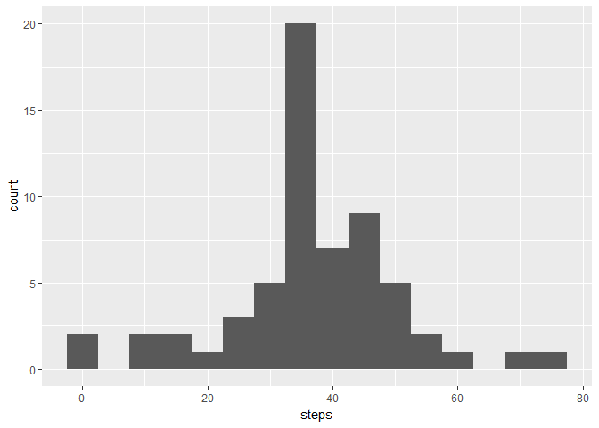
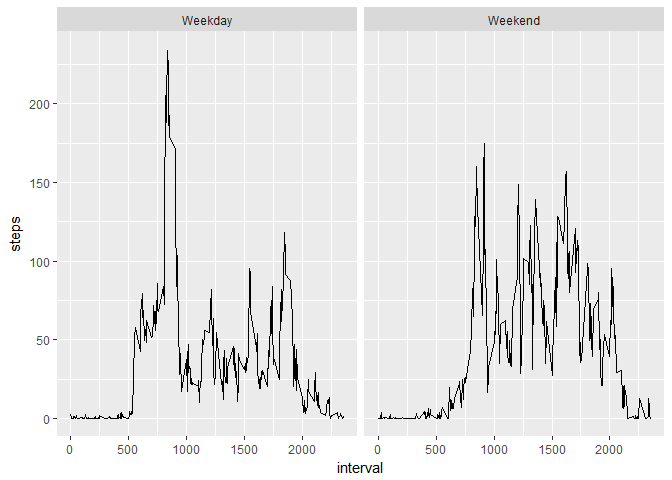

# Reproducible Research: Peer Assessment 1


## Loading and preprocessing the data


```r
###import data
activity <- read.csv(file = "activity.csv", stringsAsFactors = F)
library(ggplot2)
library(dplyr)
library(lubridate)

### format date
activity$date <- ymd(activity$date)

###grouping
avgDaily <- activity%>%group_by(date)%>%summarise(steps=mean(steps,na.rm = T))
avgInterval <- activity%>%group_by(interval)%>%summarise(steps=mean(steps,na.rm = T))

activity$weekday <- ifelse(wday(activity$date) %in% c(1,7),"Weekend","Weekday")
avgIntervalDay <- activity%>%group_by(interval,weekday)%>%summarise(steps=mean(steps,na.rm = T))
```


## What is mean total number of steps taken per day?

Histogram of steps looks like these:


```r
ggplot(avgDaily) + geom_histogram(aes(x=steps), binwidth = 5)
```

<!-- -->

Mean of steps taken each day is 37.3825996 and median is 37.3784722

## What is the average daily activity pattern?


```r
library(dplyr)
AvgSteps <-  activity%>%group_by(interval)%>%summarise(Avg.Steps=mean(steps,na.rm = T))%>%arrange(desc(Avg.Steps))
```
Daily 5-minute interval with maximum steps:

```r
AvgSteps[1,]
```

```
## # A tibble: 1 × 2
##   interval Avg.Steps
##      <int>     <dbl>
## 1      835  206.1698
```

Distribution of average number of steps per 5 minute interval.


```r
        ggplot(avgInterval) + geom_line(aes(x=interval,y=steps))
```

<!-- -->


## Imputing missing values

There are 2304 rows in variable steps with missing values, that we will replace with the mean of steps per each interval. We will join original activity table with table with average steps per interval and then use averages for rows where there is missing data.

```r
activity <- left_join(activity,AvgSteps,by="interval")
activity$steps <- ifelse(is.na(activity$steps),activity$Avg.Steps, activity$steps)
```
And finally drop column with average steps in order to keep original format.


```r
activity <- activity%>%select(-Avg.Steps)
avgDailyAfter <- activity%>%group_by(date)%>%summarise(steps=mean(steps,na.rm = T))
```
After imputting missing values histogram looks like this.

```r
ggplot(avgDailyAfter) + geom_histogram(aes(x=steps), binwidth = 5)
```

<!-- -->


Mean of steps taken each day is 37.3825996 and median is 37.3784722.

Imputting of missing values, slightly increased median, due to higher number of cases in the most frequent bin, while mean stayed apporoximately the same.


## Are there differences in activity patterns between weekdays and weekends?


```r
        ggplot(avgIntervalDay) + geom_line(aes(x=interval,y=steps)) + facet_wrap(~weekday)
```

<!-- -->
