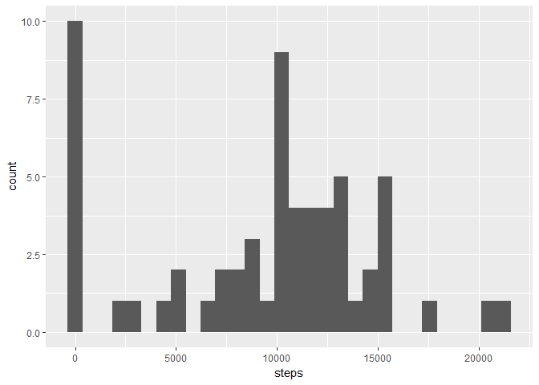
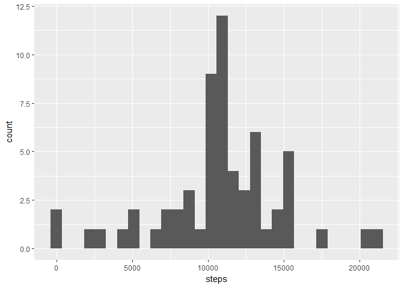
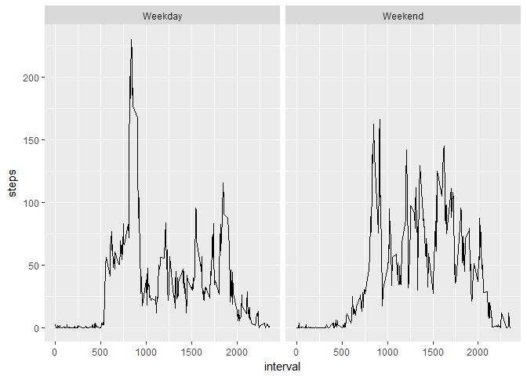

# Reproducible Research: Peer Assessment 1


## Loading and preprocessing the data


```r
###import data
activity <- read.csv(file = "activity.csv", stringsAsFactors = F)
library(ggplot2)
library(dplyr)
library(lubridate)

### format date
activity$date <- ymd(activity$date)

###defining weekdays and weekends
activity$weekday <- ifelse(wday(activity$date) %in% c(1,7),"Weekend","Weekday")

### summing daily
sumDaily <- activity%>%group_by(date)%>%summarise(steps=sum(steps,na.rm=T))
```


## What is mean total number of steps taken per day?


Mean of number of steps taken each day is 9354.23 and median is 10395

Histogram of total number of steps per each day looks like these:


```r
ggplot(sumDaily) + geom_histogram(aes(x=steps)) 
```

<!-- -->


## What is the average daily activity pattern?


```r
avgInterval <- activity%>%group_by(interval)%>%
        summarise(steps.mean=mean(steps,na.rm = T))%>%
        arrange(desc(steps.mean))
```
5-minute interval with maximum steps:

```r
avgInterval[1,]
```

```
## # A tibble: 1 × 2
##   interval steps.mean
##      <int>      <dbl>
## 1      835        206
```

Average number of steps per 5 minute interval.


```r
        ggplot(avgInterval) + geom_line(aes(x=interval,y=steps.mean))
```

<!-- -->


## Imputing missing values

There are 2304 rows with missing values of steps, that we will replace with the mean of steps per each interval. We will join original activity table with table with average steps per interval and then use averages for rows where there is missing data.

```r
activity <- left_join(activity,avgInterval,by="interval")
activity$steps <- ifelse(is.na(activity$steps),activity$steps.mean, activity$steps)
```


```r
sumDaily.NoNas <- activity%>%group_by(date)%>%summarise(steps=sum(steps,na.rm = T))
```
After imputting of missing values, mean of steps taken each day is 10766.19 steps and median is the same 10766.19 steps.

After imputting missing values histogram of number of steps taken each day looks like this.

```r
ggplot(sumDaily.NoNas) + geom_histogram(aes(x=steps))
```

<!-- -->

And finally drop column with average steps in order to keep original format.

```r
activity <- activity%>%select(-steps.mean)
```


## Are there differences in activity patterns between weekdays and weekends?


```r
###averaging days and intervals
avgIntervalDay <- activity%>%group_by(interval,weekday)%>%summarise(steps=mean(steps,na.rm = T))
```


```r
        ggplot(avgIntervalDay) + geom_line(aes(x=interval,y=steps)) + facet_wrap(~weekday)
```

<!-- -->
